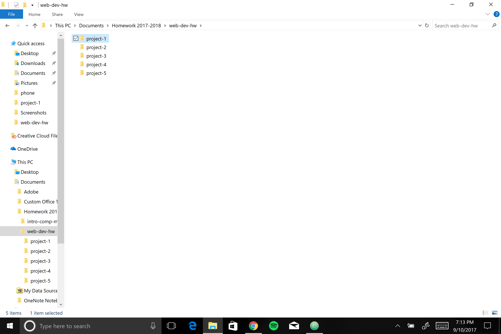
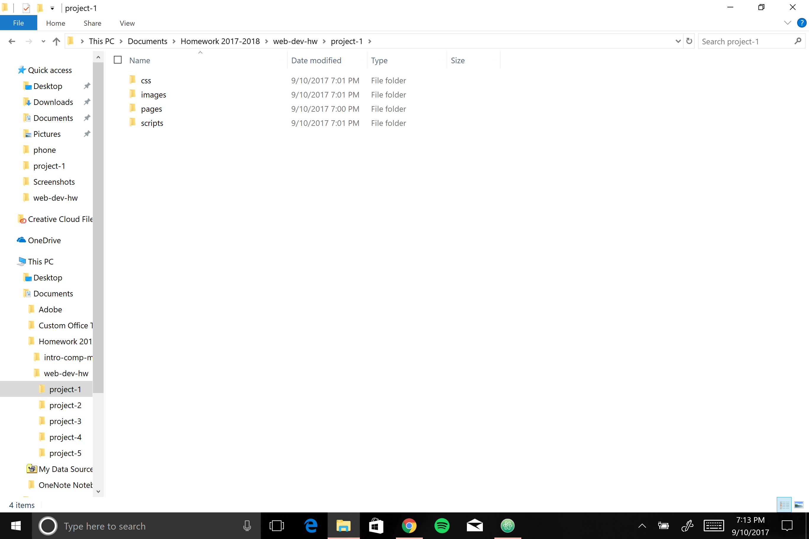

# My First README.md

## Kyla Kozole
*web-dev-hw GitHub-02 Assignment*

**My experiences:**

 - The process of getting everything set up and figuring out what I'm to do assignments on is very overwhelming.
 - I hope this course will not continue to be so ridiculously time consuming simply because it's confusing.

**My Goals**
 1. Deep Breath.
 2. Get ahead with assignments so I can be a part of the community, not just responsive.
 3. Do yoga when this document deletes itself for the 3rd time
   - learn why I messed up and wasted *so* much time.
 4. Know that this can only get better...

 `**I get why all the coding instructions are in code boxes, they do not apply formatting**`

 ---

 [Some current news since fires and floods have been *hogging* all the attention](http://www.thedenverchannel.com/news/local-news/18-wheeler-dumps-pigs-onto-i-70-near-glenwood-springs).

 ---

Here are my screenshots:

